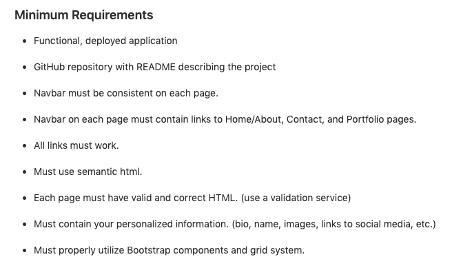

# hw2-responsive-portfolio

## Installation/Deployment

Open the html file in the browser. Another option is to go to this link: <https://github.com/skimmers/hw2-responsive-portfolio> and examine the html and css files.

Please check to see if the assignment goals are met.

## Goal

The goal is to refactor the code that the marketing company sent. I tried to make the code cleaner, concise, and accessible.

These are the requirements I had to meet: 

